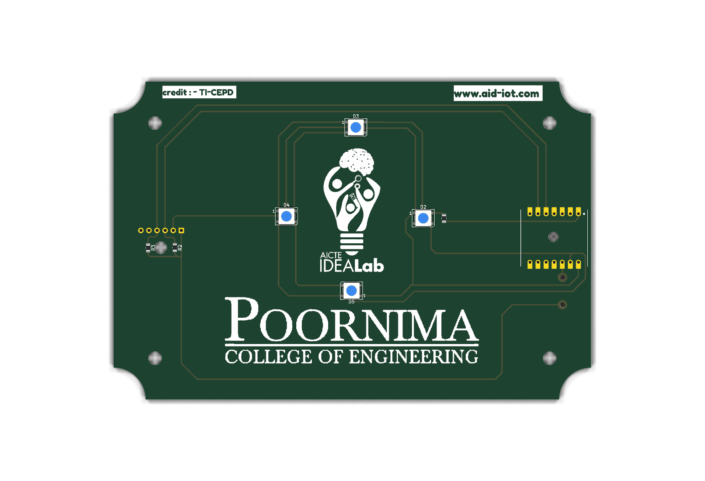
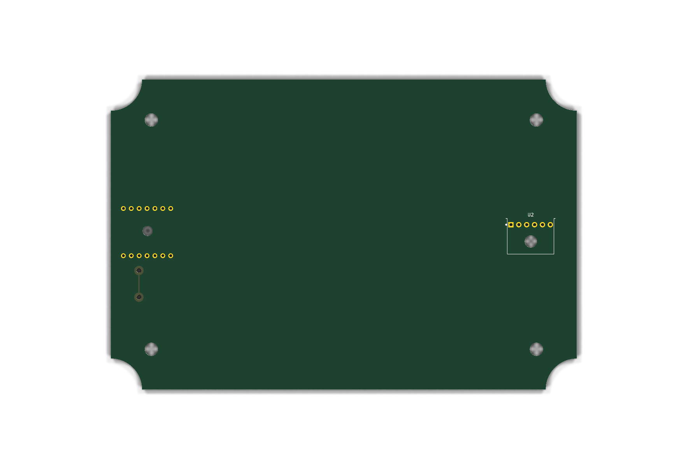

# Memento

A keepsake PCB built at the **AICTE IDEA Lab, Poornima College of Engineering**.
It is a working board as well as a memento: a Seeed XIAO ESP32C3 drives four
WS2812B LEDs and reads a BMP280 pressure/temperature sensor, and serves the
readings on a web page over WiFi. The front silkscreen carries the AICTE IDEA
Lab and Poornima College logos.



| | |
|---|---|
| Board | 150 × 100 mm, 1.6 mm, 2-layer |
| Controller | Seeed Studio XIAO ESP32C3 (RISC-V, WiFi 4 + BLE 5) |
| LEDs | 4 × WS2812B (5050 PLCC-4), daisy-chained |
| Sensor | GY-BMP280-3.3 module, I²C |
| Mounting | 4 × ⌀4.25 mm holes, 13 mm in from each edge |

## Repository layout

```
memento/
├── hw/          KiCad 10 project — schematic, PCB, project library, logo art
│   ├── memento.kicad_sch / .kicad_pcb / .kicad_pro
│   ├── memento.kicad_sym         project symbols
│   ├── memento.pretty/           project footprints
│   ├── assets/                   logo source images
│   └── tools/                    helper scripts (IPC, logo → footprint)
├── sw/          Firmware — builds in PlatformIO *and* opens in Arduino IDE
│   ├── platformio.ini
│   └── memento_fw/
│       ├── memento_fw.ino
│       ├── config.h              ← WiFi name and password go here
│       └── index_html.h          the web page
├── docs/        Project manual (.docx)
│   └── images/                   board renders used in this README
└── README.md
```

## Quick start

**1. Flash the board.** Plug the XIAO into USB-C, then either:

- *Arduino IDE* — open `sw/memento_fw/memento_fw.ino`, select board
  **XIAO_ESP32C3**, install the four Adafruit libraries, upload.
- *PlatformIO* — from `sw/`, run `pio run -t upload`.

Full steps, including the board-manager URL and library list, are in
[`sw/README.md`](sw/README.md).

**2. Set your WiFi.** Before uploading, edit `sw/memento_fw/config.h`:

```c
#define WIFI_SSID       "YOUR_WIFI_NAME"
#define WIFI_PASSWORD   "YOUR_WIFI_PASSWORD"
```

If that network cannot be joined the board starts its own hotspot
(`memento-setup` / `memento123`) so the page is still reachable.

**3. Open the page.** Open the serial monitor at **115200 baud**. It prints the
address it got:

```
Connected. Open http://192.168.1.42/  (or http://memento.local/)
BMP280 found at 0x76
HTTP server up on port 80
```

Browse to that address from any device on the same network. The page shows
temperature, pressure and altitude, refreshing every 2 seconds, and lets you set
the LED mode, colour, brightness and speed.

## Pin map

Taken from `hw/memento.kicad_sch`:

| Signal | XIAO pin | GPIO | Connects to |
|---|---|---|---|
| WS2812B data | D0 | 2 | R1 → D2.DIN → D3 → D4 → D5 |
| I²C SDA | D4 | 6 | U2.SDA, pulled up by R3 |
| I²C SCL | D5 | 7 | U2.SCL, pulled up by R2 |
| +5 V | 5V | — | WS2812B VDD ×4 |
| +3.3 V | 3V3 | — | BMP280 VCC, R2/R3 pull-ups |
| GND | GND | — | all |

## Bill of materials

| Ref | Qty | Part | Package | Notes |
|---|---|---|---|---|
| U1 | 1 | Seeed XIAO ESP32C3 | 14-pin module, 2.54 mm | Hybrid land pattern: headers or castellations |
| U2 | 1 | GY-BMP280-3.3 module | 6-pin, 2.54 mm | Runs from 3V3 |
| D2–D5 | 4 | WS2812B | 5050 PLCC-4 | Addressable RGB |
| R1 | 1 | 330 Ω | 0805 | Series on LED data line |
| R2, R3 | 2 | 4.7 kΩ | 0805 | I²C pull-ups to 3V3 |

> The resistor value fields in the schematic are still at their default
> (`R_US`). The values above are the intended ones — set them in the schematic
> before generating fabrication files.

## Building the PCB

Open `hw/memento.kicad_pro` in **KiCad 10**. The project carries its own symbol
and footprint libraries (`memento.kicad_sym`, `memento.pretty/`) registered
through the project-local `sym-lib-table` and `fp-lib-table`, so it opens
standalone with no external library setup.

The full build process — creating symbols, assigning footprints, importing the
logos to silkscreen, placement, routing and checks — is written up step by step
in the manual under [`docs/`](docs/).

The back side carries only the XIAO and BMP280 through-hole pads and the two
signal vias:



Both renders come straight from the board file, so they can be regenerated after
any layout change:

```bash
kicad-cli pcb render -o docs/images/memento-top.png \
  --side top --preset follow_pcb_editor --quality high \
  --background transparent -w 1800 -h 1240 hw/memento.kicad_pcb
```

Swap `--side top` for `--side bottom` for the other view. The
`follow_pcb_editor` preset matters: the default `follow_plot_settings` drops the
silkscreen, which renders the board as a blank rectangle with no logos.

## Documentation

| File | What it covers |
|---|---|
| [`docs/`](docs/) | Project manual (.docx) — full KiCad workflow, BOM, programming, usage |
| [`sw/README.md`](sw/README.md) | Firmware setup, libraries, HTTP API, hardware notes |
